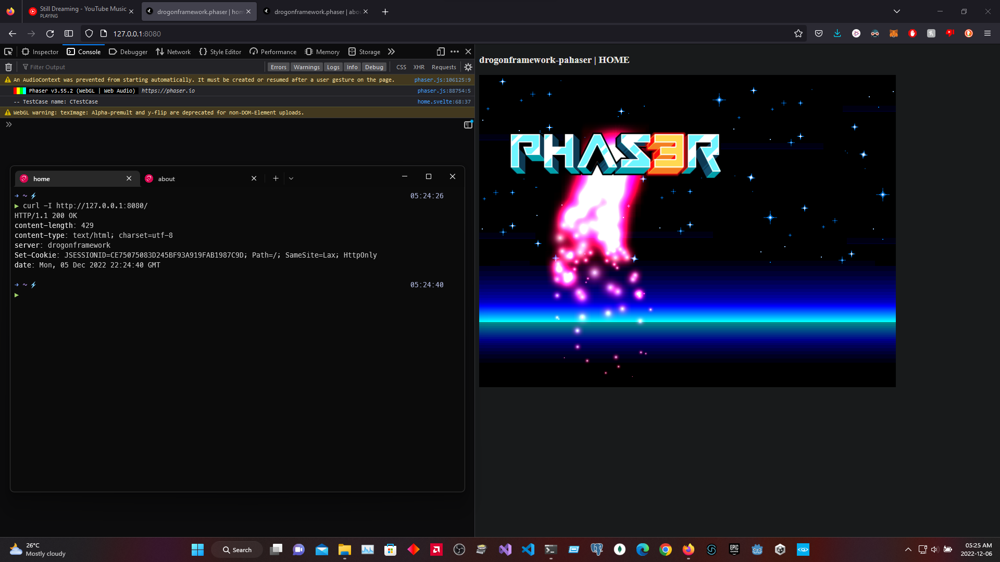
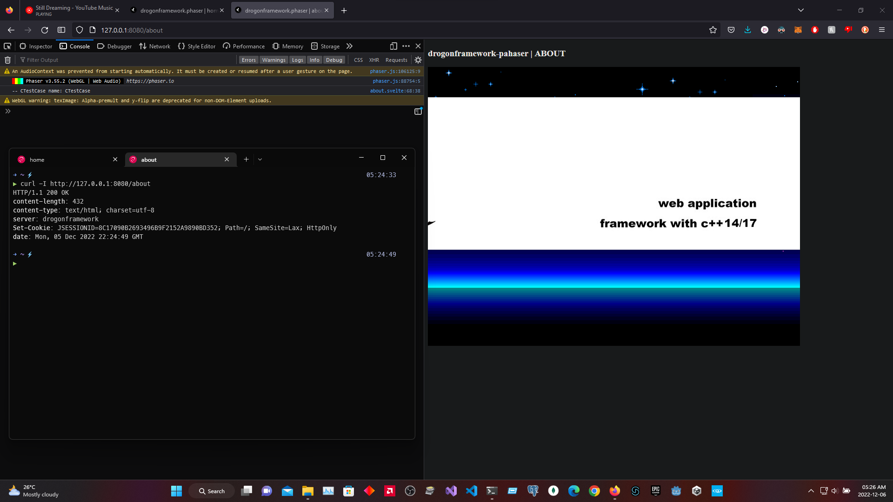

# `drogonframework-phaser`

A simple example of [drogonframework](https://github.com/drogonframework/drogon/) with [phaser](https://www.phaser.io/) & [svelte](https://svelte.dev/) integration.

`http://127.0.0.1:8080/`


`http://127.0.0.1:8080/about`


<br>

---

## why the hell this exists?

- session based web application

- less hardware process on your server

<br>

---

## about this directories

- `backend`
    ```
    project directory for drogonframework backend
    ```

- `docs`
    ```
    general notice documentation directory
    ```

- `frontend`
    ```
    project directory for nodejs build environment
    ```

- `public`
    ```
    public access/root domain directory
    ```

<br>

---

###### end of `drogonframework-phaser`
